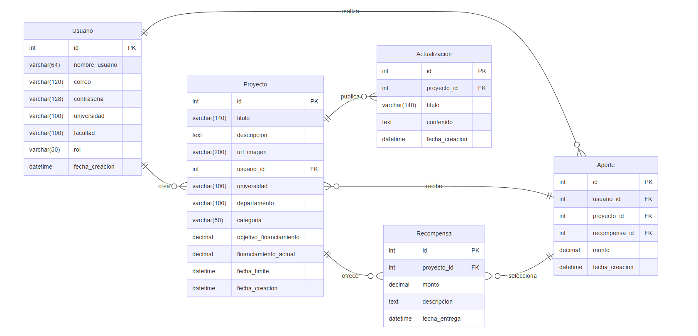

<!-- Portada -->

# Plataforma de Colaboración Académica  
## para Proyectos Innovadores en Ingeniería de Sistemas

**Integrantes:**
- Brian Danilo Chite Quispe (2021070015)  
- Piero Alexander Paja de la Cruz (2020067576)  
- Mary Luz Chura Ticona (2019065163)
--- 
<!-- Problema -->

## 🧩 Problemática

En la **Universidad Privada de Tacna**, actualmente no existe una plataforma estructurada que facilite de manera eficiente la colaboración académica y la gestión de proyectos innovadores en Ingeniería de Sistemas.  
Esto limita la interacción entre estudiantes, docentes e investigadores, dificultando el intercambio de conocimientos, la optimización de recursos y la generación de soluciones tecnológicas.

---

<!-- Objetivo General -->

## 🎯 Objetivo General

Desarrollar una plataforma web que promueva la **colaboración académica y gestión integral de proyectos innovadores** en la Escuela Profesional de Ingeniería de Sistemas de la Universidad Privada de Tacna.

---

<!-- Objetivos Específicos -->

## 🎯 Objetivos Específicos

✅ Crear un sistema de registro de usuarios con perfiles básicos  
✅ Desarrollar un módulo para publicar y organizar proyectos  
✅ Incorporar un sistema de chat por cada proyecto  
✅ Permitir comentarios y validación por parte de docentes  
✅ Mostrar públicamente un listado de proyectos destacados

---

<!-- Metodología -->

## 🧪 Metodología

1️⃣ **Etapa de análisis:** levantamiento de requerimientos y análisis de usuarios  
2️⃣ **Diseño del sistema:** wireframes, base de datos y arquitectura web  
3️⃣ **Desarrollo e implementación:** programación del backend, frontend y pruebas

---

<!-- Herramientas -->

## 🖥️ Herramientas Utilizadas

- Python 
- Flask 
- Visual Studio Code   
- MySQL   
- HTML 

---

<!-- Impacto -->

## 🌟 Impacto del Proyecto

- Mayor visibilidad y difusión de proyectos estudiantiles  
- Fomento del trabajo colaborativo entre estudiantes y docentes  
- Impulso a la innovación y vinculación con el sector empresarial  
- Mejora del proceso de retroalimentación académica

---

<!-- Modelo entidad-relación -->

## 🗂️ Modelo Entidad–Relación  
### *(Base de Datos del Sistema)*
  <!-- Centrado con ancho de 700px -->

---

<!-- Diapositiva final -->

## 📌 ¡Gracias por su atención! 🙌